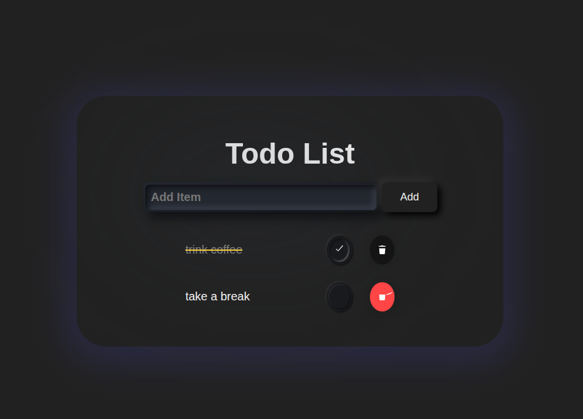

# 📝 Full-Stack ToDo App

A minimalistic and responsive **ToDo web application** with CRUD functionality. Built with **React** (frontend) and **Node.js + Express + MongoDB** (backend). Deployed on **Vercel** and **Render**.
<p align="center">

  </p>
Live demo: [https://todo-by-mr.vercel.app/](https://todo-by-mr.vercel.app/)

---

## 🚀 Features

- ✅ Add, edit, delete and mark tasks as complete
- 🎨 Clean, simple UI with responsive layout
- 🌐 RESTful API with MongoDB database
- 🔗 Frontend on Vercel, backend on Render
- 📱 Mobile-friendly (468px optimized for app look)

---

## 🧑‍💻 Tech Stack

### 🔹 Frontend
- React
- CSS (custom, mobile-first)
- Vite

### 🔹 Backend
- Node.js
- Express
- MongoDB
- Mongoose

### 🔹 Deployment
- **Frontend**: [Vercel](https://vercel.com/)
- **Backend**: [Render](https://render.com/)
- **Database**: MongoDB Atlas

---

## 📦 Folder Structure

```bash
todo-frontend/
├── public/
├── src/
│   ├── components/
│   ├── App.jsx
│   ├── index.css
│   └── main.jsx
└── README.md
```
## 👤 Author

**Maryna Rozhkova**  
Frontend Developer | Learner by Heart  
📫 [mar.rozhkova@gmail.com](mailto:mar.rozhkova@gmail.com)  
🌐 [Portfolio](https://marrozhkova-portfolio.vercel.app/)
